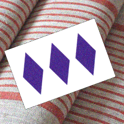
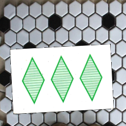

# Find a Set

A tool for finding a set of cards in a picture of a table.

## TODO
- [ ] Develop a neural network for card detection
- [ ] Optimize speed, so that the tool can be used in real time 

## Overview
The model consists of two independent parts: detection and recognition engines. The detection engine is responsible for finding the cards on the table, while the recognition engine is responsible for recognizing the cards. The detection engine uses more classical image processing approach utilizing the OpenCV library, while the recognition engine is based on a Convolutional Neural Network architecture.

## Usage
```
from models.recognizer import Recognizer
from models.detector import Detector
from models.setfinder import SetFinder

# Initialize the models
detector = Detector(180, save=True)
recognizer = Recognizer(256)
recognizer.load_state_dict(torch.load('weights/finetuned.pth'))
setfinder = SetFinder(detector, recognizer, 256, True)

# Specify the path to the image
path = 'images/IMG_2779.png'
sets = setfinder.find_sets(path)
```

## Detection engine

The detection engine is based on the OpenCV library. The algorithm is as follows:
- The input image is converted to grayscale and binarized using a predeifned threshold
- The boundaries of each region are found using the OpenCV findContours function, discrading the regions that are too small or too large
- Having found the boundaries of the regions, the algorithm checks if the region is a card by checking if the region is contained in any of the remaining regions. If it is, the region is discarded
- Finally, the obtained card regions are cropped from the input image, resized and unified to a sqaure image of a given size for further processing


<p align="center">
  <br/>
  
</p>


## Recognition engine

The recognition engine is a Convolutional Neural network, with 6 layers (the exact architecture is available at `models/recognizer.py`) followed by a fully connected layer. A pretrained model is currently unavailable, as I deleted it with an uncareful use of a `git reset` command and I am currently training a new one. The model is trained using Adam optimizer, with initial learning rate 0.0005, on batches of size 32. The images for each batch are generated dynamically from the dataset of collected backgrounds and scanned cards; an example of such a batch is available at `dataset/random`.

After training, models from different epochs are evaluated against accuracy on a validation set, consisting of 93 real-life card images, and the model with the highest accuracy (the best model achieved 100% recognition score) is saved.

<p align="center">
  <br/>
  
  
  
</p>


## SetFinder
The `SetFinder` class is a wrapper for the `Detector` and `Recognizer` classes. It is responsible for finding the sets in the image. For each card, the `SetFinder` class first detects the card and then recognizes it.Then, it finds all the sets in the image by checking all the possible combinations of 3 cards.

## Results
The results of the finetuned model are very satisfactory. The model is able to recognize the detected cards and  with 100% accuracy on the test set.

<p align="center">
  <br/>
  
</p>

```
Detected cards:
Card #1: blue wave clean 2
Card #2: blue romb clean 1
Card #3: blue romb full 3
Card #4: green wave full 1
Card #5: green oval strip 1
Card #6: blue oval clean 1
Card #7: green oval clean 3
Card #8: green romb full 2
Card #9: green wave strip 2
Card #10: red wave strip 2
Card #11: blue wave full 1
Card #12: red wave full 1


There are 2 sets in this photo
------------------------------
blue romb clean 1
green oval strip 1
red wave full 1
--------------------
green wave full 1
blue wave full 1
red wave full 1
--------------------
```